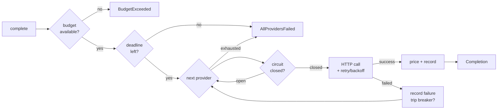

<div align="center">

# llm-gateway

**Your LLM provider will go down. This is the ~1,500 lines that keep your product up.**

Automatic failover, circuit breaking, bounded latency and per-request cost tracking
across Anthropic, OpenAI and Google — in one small library with one dependency.

[](https://github.com/uaesivakumar/llm-gateway/actions/workflows/ci.yml)
[](#development)
[](#development)
[](https://www.python.org/)
[](LICENSE)
[](pyproject.toml)

</div>

---

```python
from llm_gateway import Gateway, AnthropicProvider, OpenAIProvider, GoogleProvider

gateway = Gateway(
    [
        AnthropicProvider("claude-sonnet-4-5"),   # primary
        OpenAIProvider("gpt-5.4"),                # first fallback
        GoogleProvider("gemini-2.5-flash"),       # last resort
    ],
    budget_usd=25.00,
    deadline_s=20.0,
)

reply = gateway.complete("Explain retrieval-augmented generation in one sentence.")
```

Anthropic is having a bad afternoon. Your code above does not change, and this is what it does:

```text
anthropic:claude-sonnet-4-5   1,204ms   ProviderUnavailable: overloaded_error   ← retried twice, then gave up
openai:gpt-5.4                  631ms   ok                                      ← answered

reply.text          "RAG retrieves relevant documents and feeds them to a model as context."
reply.provider      openai
reply.failed_over   True
reply.usage         1,412 in / 96 out  ·  $0.002486
gateway.health()    {'anthropic:claude-sonnet-4-5': 'open', 'openai:gpt-5.4': 'closed'}
```

The failover is automatic. The trail is not hidden — `reply.attempts` records every try, so
a silent fallback is never actually silent. Anthropic is now cut out of rotation for 30
seconds instead of being retried on every request.

> Run this yourself with no API keys and no network:
> `python examples/failover_and_budget.py`

---

## Install

```bash
pip install git+https://github.com/uaesivakumar/llm-gateway.git
```

Python 3.10+. Set whichever keys you plan to use:

```bash
export ANTHROPIC_API_KEY=...   # or pass api_key= explicitly
export OPENAI_API_KEY=...
export GEMINI_API_KEY=...
```

---

## Should you use this, or LiteLLM?

Genuine answer first: **if you need 140+ providers, a proxy server, a UI, caching and a
full platform, use [LiteLLM](https://github.com/BerriAI/litellm).** It is excellent, it is
far broader than this, and this project does not try to replace it.

This exists for the other case — when you want the resilience behaviour *inside* your
process, with a codebase you can read end to end in an afternoon and vendor if you have to.

| | **llm-gateway** | **LiteLLM** | **Raw provider SDKs** |
|---|---|---|---|
| Providers | 3 built in, plus any OpenAI-compatible endpoint | 140+ | one each |
| Shape | library, in-process | library **or** proxy server | library |
| Runtime dependencies | **1** (`httpx`) | many | one SDK per provider |
| Failover across providers | built in | built in | you write it |
| Circuit breaking | built in | built in | you write it |
| Bounded worst-case latency | `deadline_s` | via timeouts | you write it |
| Cost tracking | per request; unknown prices report `None` | extensive | none |
| Auditable in one sitting | ~1,500 lines | no | n/a |

Reach for this when the dependency tree matters (regulated environments, vendored code,
tight security review), when you only use two or three providers anyway, or when you want
to understand exactly what happens on failure rather than configure it.

---

## How it works



Retry and failover are **two independent loops**, which is the whole point: retry handles a
provider having a bad second, failover handles a provider having a bad hour.

| Layer | Handles | Behaviour |
|---|---|---|
| `RetryPolicy` | transient 429 / 5xx / timeouts | exponential backoff with full jitter, honours `Retry-After` |
| `CircuitBreaker` | a provider that is actually down | opens after N consecutive failures, one probe after cooldown |
| `Gateway` | provider selection | ordered or cheapest-first, skips open circuits, enforces the deadline |
| `Ledger` | spend | per-call cost, aggregation, pre-flight budget gate |

---

## What you get

### Failover you can audit

```python
for a in reply.attempts:
    print(a.provider, a.model, f"{a.latency_ms:.0f}ms", "ok" if a.ok else a.error_type)
```

### Circuit breaking

A provider that keeps failing is cut out rather than retried on every request. After the
cooldown, exactly one probe is admitted — success closes the circuit, failure re-opens it.

```python
gateway.health()   # {'anthropic:claude-sonnet-4-5': 'open', 'openai:gpt-5.4': 'closed'}
```

An authentication failure opens the circuit **immediately**. A bad key will not fix itself,
and there is no reason to spend the whole failure budget discovering that.

### Bounded worst-case latency

Three providers with three retries each can quietly stack into minutes. `deadline_s` caps it:

```python
Gateway([...], deadline_s=20.0)
```

Checked before each provider and before each retry backoff — a retry whose wait would not
fit is skipped rather than started. It does not abort a request already in flight (that is
what each provider's `timeout` is for), so the honest worst case is `deadline_s` plus one
timeout, not `deadline_s` exactly.

### Cost tracking that refuses to guess

```python
gateway.ledger.summary()
# {'anthropic:claude-sonnet-4-5': {'calls': 812, 'input_tokens': 1_204_113,
#                                  'output_tokens': 96_040, 'cost_usd': 5.053,
#                                  'unpriced_calls': 0}}
```

If a model is not in the price table, `usage.cost_usd` is `None` — never a plausible-looking
`0.0` — and the call is counted in `ledger.unpriced_calls`. Override any price without
waiting on this repo:

```python
from llm_gateway import ModelPrice
OpenAIProvider("my-finetune", price=ModelPrice(input_per_mtok=0.6, output_per_mtok=2.4))
```

### Budgets

```python
gateway = Gateway([...], budget_usd=10.00)
gateway.ledger.remaining_usd   # 4.17
```

A **pre-flight gate**: once spend reaches the limit, `complete()` raises `BudgetExceeded`
before dispatching. Not a mid-flight abort — cancelling a request you have already paid for
saves nothing. Cap per-call exposure with `max_tokens`.

### Cheapest-first routing

```python
Gateway([...], order="cheapest")   # ranked by a nominal 1k-in / 1k-out call
```

Unpriced providers sort last, so an unknown model never wins on a cost it cannot prove.

### Async, with identical semantics

```python
reply = await gateway.acomplete("hello")
```

### OpenAI-compatible endpoints

Anything speaking the Chat Completions API — vLLM, Ollama, OpenRouter, Together, Azure
OpenAI — works by pointing `base_url` at it, and can sit in the same failover chain as the
hosted providers:

```python
OpenAIProvider("llama-3.3-70b", base_url="http://localhost:8000", use_legacy_max_tokens=True)
```

---

## Adding a provider

Subclass `BaseProvider` and describe three things. Transport, timeouts, retries, deadlines,
latency measurement and sync/async parity are inherited:

```python
from llm_gateway.providers.base import BaseProvider, PreparedRequest, ParsedResponse

class MyProvider(BaseProvider):
    name = "mine"
    default_base_url = "https://api.example.com"

    def prepare(self, messages, params):
        return PreparedRequest(
            url=f"{self.base_url}/v1/generate",
            headers={"authorization": f"Bearer {self.api_key}"},
            json={"model": self.model,
                  "input": [{"role": m.role, "text": m.content} for m in messages]},
        )

    def parse(self, data):
        return ParsedResponse(
            text=data["output"]["text"],
            input_tokens=data["usage"]["in"],
            output_tokens=data["usage"]["out"],
        )
```

Override `classify()` too if the API uses non-standard status codes. PRs welcome.

---

## Design decisions

The parts most worth disagreeing with, and why they are the way they are:

**Unknown prices resolve to `None`, not `0.0`.** A hardcoded price table goes stale
silently, which is worse than having none — the numbers still look authoritative. Prices
live in `prices.json` as data stamped with an `as_of` date, and anything unrecognised is
reported as unmeasured rather than free.

**Retry and failover are separate loops.** Retrying the same dead provider five times before
trying a healthy one adds latency and buys nothing.

**Non-retryable errors still fail over.** A 400 from one provider may be a perfectly valid
request for another — different context limits, different content filters. It is not retried
against the *same* provider, but the next one gets a turn.

**Budgets gate, not abort.** A mid-flight kill wastes money already committed.

**Deadlines bound attempts, not in-flight calls.** Anything else would mean racing a
cancellation against a response, and reporting a worst case the library cannot actually
honour.

**No streaming yet.** Streaming plus mid-stream failover is genuinely harder: once the first
token is out you cannot transparently switch providers without either buffering or exposing
the seam. Shipping a half-answer would be worse than not shipping it. See the roadmap.

**One runtime dependency.** Provider SDKs move fast and disagree with each other about auth,
retries and typing. Three HTTP shapes are less code than three SDKs, and they do not fight
over transitive versions.

---

## Development

```bash
git clone https://github.com/uaesivakumar/llm-gateway.git
cd llm-gateway
pip install -e ".[dev]"

pytest                                   # 115 tests, ~0.3s, no network
pytest --cov=llm_gateway                 # 94% coverage
ruff check .
```

Every test runs against `httpx.MockTransport` with injected clocks, so the suite is fully
deterministic, needs no API keys, and contains no `sleep()` calls.

Three bugs the suite caught during development, kept as regression tests:

- `Ledger` defines `__len__`, so an empty ledger is falsy — `ledger or Ledger(...)` silently
  discarded a caller-supplied ledger (`test_supplied_ledger_is_used_even_when_empty`).
- A `200` response carrying a non-JSON body parsed into an empty completion that looked
  successful and billable (`test_malformed_success_body_is_reported_not_crashed`).
- Retry backoff was taken even when the caller's deadline could not absorb it
  (`test_retry_is_skipped_when_backoff_would_blow_the_deadline`).

---

## Roadmap

- [ ] Streaming, with explicit (non-transparent) failover semantics
- [ ] Prompt-caching and batch-tier pricing
- [ ] Tool / function calling normalised across providers
- [ ] Optional OpenTelemetry span per attempt
- [ ] Publish to PyPI

Issues and PRs welcome — see [CONTRIBUTING.md](CONTRIBUTING.md). Good first issues are
labelled [`good first issue`](https://github.com/uaesivakumar/llm-gateway/labels/good%20first%20issue).

---

## License

MIT — see [LICENSE](LICENSE).

Built by [Sivakumar Chandrasekaran](https://sivakumar.ai) — AI Solutions Architect, Abu Dhabi.
