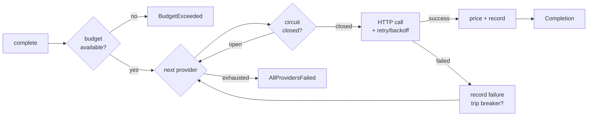

<div align="center">

# llm-gateway

**One interface across Anthropic, OpenAI and Google — with automatic failover, circuit breaking, and per-request cost tracking.**

[](https://github.com/uaesivakumar/llm-gateway/actions/workflows/ci.yml)
[](https://www.python.org/)
[](LICENSE)
[](pyproject.toml)

</div>

---

When a single LLM provider goes down, your product goes down with it. The usual fix is a `try/except` around a second SDK — which works until you need retries that respect `Retry-After`, a way to stop hammering a provider that is clearly dead, and an answer to "what did we spend last month, and on which model?"

This is that layer, extracted from production systems and kept deliberately small: **one runtime dependency (`httpx`), no SDK lock-in, ~1,400 lines of implementation and 91 tests.**

```python
from llm_gateway import Gateway, AnthropicProvider, OpenAIProvider, GoogleProvider

gateway = Gateway(
    [
        AnthropicProvider("claude-sonnet-4-5"),   # primary
        OpenAIProvider("gpt-5.4"),                # first fallback
        GoogleProvider("gemini-2.5-flash"),       # last resort
    ],
    budget_usd=25.00,
)

reply = gateway.complete("Explain retrieval-augmented generation in one sentence.")

print(reply.text)
print(reply.provider, reply.model)      # who actually answered
print(reply.usage.cost_usd)             # 0.000191
print(gateway.ledger.total_cost_usd)    # running spend
```

If Anthropic returns a 529, the call is retried with jittered backoff; if it keeps failing, the circuit opens and OpenAI answers instead — all inside that one `complete()` call. `reply.attempts` tells you exactly what happened.

---

## Install

```bash
pip install git+https://github.com/uaesivakumar/llm-gateway.git
```

Requires Python 3.10+. Set whichever keys you plan to use:

```bash
export ANTHROPIC_API_KEY=...   # or pass api_key= explicitly
export OPENAI_API_KEY=...
export GEMINI_API_KEY=...
```

---

## How it works



Two independent loops, which is the point: **retry** handles a provider having a bad second, **failover** handles a provider having a bad hour.

| Layer | Handles | Behaviour |
|---|---|---|
| `RetryPolicy` | transient 429 / 5xx / timeouts | exponential backoff with full jitter, honours `Retry-After` |
| `CircuitBreaker` | a provider that is actually down | opens after N consecutive failures, one probe after cooldown |
| `Gateway` | provider selection | ordered or cheapest-first, skips open circuits |
| `Ledger` | spend | per-call cost, aggregation, pre-flight budget gate |

---

## What you get

### Failover you can audit

Every completion carries its full attempt chain, so a silent fallback is never actually silent:

```python
reply = gateway.complete("hello")

if reply.failed_over:
    for a in reply.attempts:
        status = "ok" if a.ok else f"{a.error_type}: {a.error}"
        print(f"{a.provider}:{a.model}  {a.latency_ms:.0f}ms  {status}")

# anthropic:claude-sonnet-4-5   812ms  ProviderUnavailable: overloaded_error
# openai:gpt-5.4                634ms  ok
```

### Circuit breaking

A provider that fails repeatedly is cut out rather than retried on every request. After the cooldown, exactly one probe is admitted — success closes the circuit, failure re-opens it.

```python
gateway.health()
# {'anthropic:claude-sonnet-4-5': 'open', 'openai:gpt-5.4': 'closed'}
```

An authentication failure opens the circuit **immediately**: a bad key will not fix itself, and there is no reason to spend the whole failure budget discovering that.

### Cost tracking that refuses to guess

```python
gateway.ledger.summary()
# {'anthropic:claude-sonnet-4-5': {'calls': 812, 'input_tokens': 1_204_113,
#                                  'output_tokens': 96_040, 'cost_usd': 5.053,
#                                  'unpriced_calls': 0}}
```

If a model is not in the price table, `usage.cost_usd` is `None` — never a plausible-looking `0.0` — and the call is counted in `ledger.unpriced_calls`. Override any price without waiting on this repo:

```python
from llm_gateway import ModelPrice
OpenAIProvider("my-finetune", price=ModelPrice(input_per_mtok=0.6, output_per_mtok=2.4))
```

### Budgets

```python
gateway = Gateway([...], budget_usd=10.00)
gateway.ledger.remaining_usd   # 4.17
```

The budget is a **pre-flight gate**: once spend reaches the limit, `complete()` raises `BudgetExceeded` before dispatching. It is not a mid-flight abort — cancelling a request you have already paid for saves nothing. Cap per-call exposure with `max_tokens`.

### Cheapest-first routing

```python
Gateway([...], order="cheapest")   # ranked by a nominal 1k-in/1k-out call
```

Unpriced providers sort last, so an unknown model never wins on a cost it cannot prove.

### Async, with identical semantics

```python
reply = await gateway.acomplete("hello")
```

### OpenAI-compatible endpoints

Anything speaking the Chat Completions API — vLLM, Ollama, OpenRouter, Together, Azure OpenAI — works by pointing `base_url` at it, and can sit in the same failover chain as the hosted providers:

```python
OpenAIProvider("llama-3.3-70b", base_url="http://localhost:8000", use_legacy_max_tokens=True)
```

---

## Adding a provider

Subclass `BaseProvider` and describe three things. Transport, timeouts, retries, latency measurement and sync/async parity are inherited:

```python
from llm_gateway.providers.base import BaseProvider, PreparedRequest, ParsedResponse

class MyProvider(BaseProvider):
    name = "mine"
    default_base_url = "https://api.example.com"

    def prepare(self, messages, params):
        return PreparedRequest(
            url=f"{self.base_url}/v1/generate",
            headers={"authorization": f"Bearer {self.api_key}"},
            json={"model": self.model,
                  "input": [{"role": m.role, "text": m.content} for m in messages]},
        )

    def parse(self, data):
        return ParsedResponse(
            text=data["output"]["text"],
            input_tokens=data["usage"]["in"],
            output_tokens=data["usage"]["out"],
        )
```

Override `classify()` too if the API uses non-standard status codes.

---

## Design decisions

Choices here that were deliberate, and the reasoning, since they are the parts most worth disagreeing with:

**Unknown prices resolve to `None`, not `0.0`.** A hardcoded price table goes stale silently, which is worse than having none — the numbers still look authoritative. Prices live in `prices.json` as data stamped with an `as_of` date, and anything unrecognised is reported as unmeasured rather than free.

**Retry and failover are separate loops.** Retrying the same dead provider five times before trying a healthy one adds latency and buys nothing. Retries absorb transient faults; failover absorbs outages.

**Non-retryable errors still fail over.** A 400 from one provider may be a perfectly valid request for another — different context limits, different content filters. The request is not retried against the *same* provider, but the next one gets a turn.

**No streaming yet.** Streaming plus mid-stream failover is a genuinely harder problem: once the first token has been emitted you cannot transparently switch providers without either buffering or exposing the seam. Shipping a half-answer would be worse than not shipping it. See the roadmap.

**Budgets gate, not abort.** Explained above — a mid-flight kill wastes money already committed.

**One runtime dependency.** Provider SDKs move fast and disagree with each other about auth, retries and typing. Three HTTP shapes are less code than three SDKs, and they do not fight over transitive versions.

---

## Development

```bash
git clone https://github.com/uaesivakumar/llm-gateway.git
cd llm-gateway
pip install -e ".[dev]"

pytest          # 91 tests, no network access required
ruff check .
```

Every test runs against `httpx.MockTransport` and injected clocks, so the suite is fully deterministic and finishes in well under a second. There are no live API calls and no `sleep()` calls in the test path.

Two bugs the suite caught during development, kept as regression tests:

- `Ledger` defines `__len__`, so an empty ledger is falsy — `ledger or Ledger(...)` silently discarded a caller-supplied ledger (`test_supplied_ledger_is_used_even_when_empty`).
- A `200` response carrying a non-JSON body parsed into an empty completion that looked successful and billable (`test_malformed_success_body_is_reported_not_crashed`).

---

## Roadmap

- [ ] Streaming with explicit, non-transparent failover semantics
- [ ] Prompt-caching and batch-tier pricing
- [ ] Tool / function calling normalised across providers
- [ ] Optional OpenTelemetry spans per attempt
- [ ] Publish to PyPI

Issues and PRs welcome — see [CONTRIBUTING.md](CONTRIBUTING.md).

---

## License

MIT — see [LICENSE](LICENSE).

Built by [Sivakumar Chandrasekaran](https://sivakumar.ai), AI Solutions Architect, Abu Dhabi.
